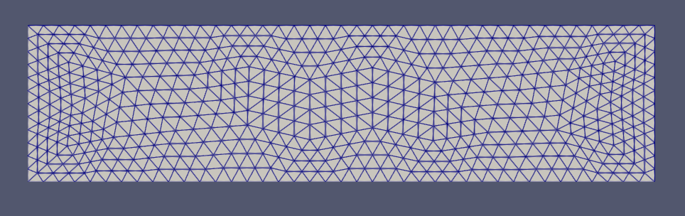

# pyFEM2D

Programa em Python para cálculo de estruturas pelo Método dos Elementos Finitos.
Atualmente suporta apenas elementos triangulares lineares de deformação constante (CST).

Exporta os resultados no formato VTK Legacy, suporta os campos de deslocamentos, forças aplicadas e tensões.

